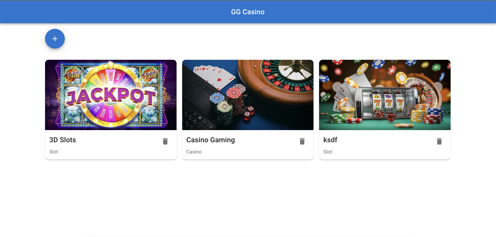

# GG Casino

GG Casino is a fictional casino company, where the employees can manage which games the users are able to play.



## Getting Started

These instructions will get you a copy of this project up and running on your local machine for development and testing purposes.

### Installing

- Open your local development terminal
- `cd` into the directory that you want the project to reside e.g:

```
cd projects
```

- Clone the repository into that directory

```
git clone https://github.com/lumie31/GGCasino.git
```

- Run `npm install` to install the project dependencies
- Run `npm start` to start a local development server
- Navigate to http://localhost:3000 to view the project

## Live Demo

A fully functional demo of this project is hosted on Netlify and is available here: https://gg-casino.app/

## App Features

- Main view where all the games are displayed in a grid as cards
- Ability to add, remove and reorder the games in the grid.
- Mobile responsive

## Built With

- [React.js](https://www.reactjs.org) - Javascript library for building user interfaces
- [Material UI](https://mui.com/) - MUI offers a comprehensive suite of UI tools to help you ship new features faster.
- [Netlify](https://www.netlify.com) - For easy deployment of web apps

## For v2.0

- Manage application state using Redux and Redux saga
- Add Tests with Jest and React Testing Library
